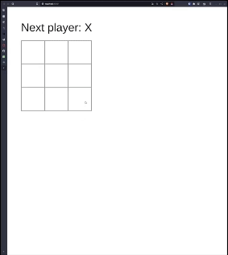

# CS3750 Portfolio
This contains the projects that I worked on during CS3750 at WSU. The included projects are:
* A tic-tac-toe game
* A connect four game that also includes highscore functionality
* An authentication app that salts and hashes users passwords
* The beginnings of a online speed card game using sockets

## Tic-Tac-Toe Game Project



The Tic-Tac-Toe game project provides an interactive web-based version of the well-known Tic-Tac-Toe game. Players take turns marking empty cells on a 3x3 grid with their respective symbols, "X" and "O." The goal is to be the first to form a horizontal, vertical, or diagonal line of three of their symbols.

The core component of the project is the `Board` React component, which renders the game board and handles player interactions. The game status, including the current player's turn and game outcome, is displayed dynamically on the interface.

### Technologies Used

- **React**: The user interface and interactive components are developed using React, a JavaScript library for building user interfaces.

- **JavaScript**: The game logic, including turn management, win detection, and user interactions, is implemented using JavaScript.

- **CSS**: Styling and layout for the game board and user interface are applied using CSS (Cascading Style Sheets).

### Technical Challenges

- **Game Logic**: Implementing the core game logic, such as determining a win condition and detecting a tie, required careful consideration of the possible winning combinations.

- **Component Interactions**: Ensuring seamless interaction between components, such as updating the game state on square clicks and managing player turns, was crucial for a smooth gameplay experience.

- **Dynamic Status Updates**: Dynamically updating and displaying the game status, including the current player and game outcome, while ensuring a responsive and user-friendly interface was a significant challenge to tackle at the beginning with limited MERN experience. This was solved in a handler function:
```javascript
function handleClick(i) {
    if (squares[i] || calculateWinner(squares)) return; // if square is already filled, return (do nothing
    const nextSquares = squares.slice();
    if (xIsNext) {
      nextSquares[i] = "X";
    } else {
      nextSquares[i] = "O";
    }

    setSquares(nextSquares);
    setXIsNext(!xIsNext);
}
```


## Connect Four Game

This project is a web-based implementation of the classic Connect Four game, built using the MERN (MongoDB, Express.js, React, and Node.js) stack. This builds upon the front-end worked on for the Tic-Tac-Toe app and adds the full MERN stack to include access to a DB to store records.

The Connect Four game project provides an interactive and engaging experience of the popular Connect Four game. Players take turns dropping colored discs into a vertically suspended grid. The goal is to form a line of four discs of the same color horizontally, vertically, or diagonally before the opponent does. The game's web-based interface allows players to make their moves by clicking on the desired column in the game grid.

### Technologies Used

- **React**: The front-end user interface is built using React, a popular JavaScript library for building user interfaces. It enables dynamic rendering and efficient updates based on the game state.

- **Express.js**: The back-end server is developed using Express.js, a fast and minimalist web application framework for Node.js. Express.js is used to define API routes and handle HTTP requests.

- **MongoDB**: The game records are stored in a MongoDB database. MongoDB is a NoSQL database that provides a flexible and scalable solution for storing and managing data.

- **Node.js**: The backend server runs on Node.js, a runtime environment that allows developers to execute JavaScript on the server side.

- **React Router**: React Router is used for client-side routing, allowing users to navigate between different components of the application without a full page reload.

### Technical Challenges

- **Game Logic**: Implementing the game logic to determine winners based on horizontal, vertical, and diagonal connections required careful consideration and testing. The simulation of gravity was especially difficult, but was solved with a simple for loop. The game.js component efficiently manages the state and flow of the game. Here is how gravity was solved:
```javascript
for (let j = 0; j <= 41; j++) {
      if (!nextSquares[j]) {
        if (j - 7 >= 0 && nextSquares[j - 7]) {
          nextSquares[j] = nextSquares[j - 7];
          nextSquares[j - 7] = null;
        }
    }
}
```

- **Dynamic Styling**: Styling the game board to reflect player moves and provide visual feedback posed a challenge. The use of dynamic styling in the Square component was essential to achieve this.

- **Data Management**: Managing game records, including creating, fetching, updating, and deleting records, required setting up API routes and integrating them with the front end.


## User Registration and Password Salting Application

This app is a React-based web interface that allows users to create an account (for nothing in particular) to demonstrate salting and hashing while building upon the MongoDB used in the Connect Four app above. The application utilizes the MERN (MongoDB, Express.js, React, and Node.js) stack to provide a seamless user experience. 

### Technologies Used

The NewUser app is built using the following technologies:

- **React**: The user interface and interactive components are developed using React, a JavaScript library for building user interfaces.

- **Express**: The app's backend server is built using Express, a web application framework for Node.js.

- **MongoDB**: User records and information are stored in a MongoDB database.

- **bcrypt**: The `bcrypt` library is used to securely hash and store user passwords in the database.

- **JavaScript**: The app's logic and validation are implemented using JavaScript.

- **CSS**: Styling and layout for the user registration form are applied using CSS.

### Technical Challenges

During the development of the NewUser app, several technical challenges were addressed:

- **Password Complexity Validation**: Implementing password complexity validation required analyzing and scoring passwords based on criteria such as length, character types, and special characters.

- **Secure Password Storage**: Ensuring secure storage of user passwords in the database involved using the `bcrypt` library to hash passwords before storing them. Here is the method used to salt and hash the passwords:
```javascript
router.post("/", async (req, res) => {
    const salt = bcrypt.genSaltSync();
    const hashedPassword = bcrypt.hashSync(req.body.password, salt); 

    let newUser = {
        accountType: req.body.accountType,
        username: req.body.username,
        password: hashedPassword,
        salt: salt
    }

    let collection = await db.collection("records");
    let result = await collection.insertOne(newUser);
    res.send(result).status(204);
});
```

- **Backend Integration**: Integrating the frontend and backend components of the app, including handling form submissions and database interactions, required establishing communication between React and Express.

## Speed Card Game App

This Speed Card Game app was developed as a group project, with a focus on real-time gameplay using socket.io. My main role was working on the socket connections and creating separate game rooms for players.

### Technologies Used

- React: Used for building the frontend user interface of the game, including the chat feature and game room selection.
- Node.js: Backend runtime environment for running the server and handling socket.io connections.
- Express: Web application framework used to handle routing and API endpoints.
- Socket.io: Real-time communication library used to implement multiplayer functionality and real-time updates.
- MongoDB (not seen in provided code): A database used to store user information and game states.
- React Bootstrap: Utilized for styling and designing the user interface.
- React Router: Used for routing and navigation within the app.

### Technical Challenges

1. **Socket Communication**: Implementing real-time multiplayer functionality using socket.io required establishing a connection between the client and the server. Synchronizing game states, chat messages, and player actions in real-time while ensuring smooth gameplay was a key challenge.

2. **Game Room Management**: Creating and managing separate game rooms for players was crucial to isolate their gameplay experience. Handling room creation, joining, and leaving while maintaining the integrity of each game room was a complex task.

3. **Data Synchronization**: Ensuring that each player's game state remains synchronized and consistent across devices and platforms was a significant technical challenge. Handling various edge cases and ensuring data integrity was important for fair gameplay.

4. **User Authentication and Storage (not seen in provided code)**: If the app includes user authentication and data storage, integrating it with the game logic and ensuring secure storage of user information and game states would require careful implementation.

### My Contributions

- Implementing socket.io connections for real-time communication between players.
- Designing and developing the frontend interface for the game room selection and chat feature.
- Creating separate game rooms and managing player interactions within those rooms.
- Handling synchronization of game states and player actions through socket.io.

**This is the backend logic for sockets**
```javascript
// server/server.mjs
  socket.on("getRooms", () => {
    console.log("getRooms on server.mjs");
    socket.emit("roomList", rooms);
  });

  socket.on("createRoom", () => {
    // generate a random room id
    const room = v4();
    socket.join(room);
    rooms.push(room);
    console.log("Room created on server.mjs:", room);
    socket.emit("roomCreated", room);
    socket.emit("roomList", rooms);
  });

  socket.on("joinRoom", (username, roomID) => {
    console.log(username + " joined " + roomID);
    userRooms[username] = roomID;
    if (!occupiedRooms[roomID]) {
      occupiedRooms[roomID] = [username];
    } else {
      occupiedRooms[roomID] = [...occupiedRooms[roomID], username];
    }
    if (occupiedRooms[roomID].length === 2) {
      io.emit("roomFull", roomID);
    }
    socket.join(roomID);
    socket.emit("roomJoined", roomID);
  });

  socket.on("userJoined", (username) => {
    console.log(username + " joined the server");
    socket.emit("joinedRoom", userRooms[username]);
  });
```
**Here is the frontend logic using the socket connections for room handling**
```javascript
// client/foyer.js
  useEffect(() => {
    // Emit "getRooms" event to fetch the room list when the component mounts
    socket.emit("getRooms");

    // Listen for "roomList" event and update rooms state
    socket.on("roomList", (roomList) => {
      setRooms(roomList);
    });

    // Clean up socket listeners when the component unmounts
    return () => {
      socket.off("roomList");
    };
  }, []);

  const handleCreateRoom = () => {
    if (roomNumber === "") {
      socket.emit("createRoom");
      socket.on("roomCreated", (roomID) => {
        console.log("roomCreated event received with roomID:", roomID);
        setRoomNumber(roomID);
      });
      socket.on("roomList", (roomList) => {
        setRooms(roomList);
      });
    }
  };

  const handleJoinRoom = (roomID) => {
    socket.emit("joinRoom", name, roomID);
    socket.on("roomJoined", (roomID) => {
      console.log("roomJoined event received with roomID:", roomID);
      setRoomNumber(roomID);
    });
    // redirect user
    navigate(`/classic-speed/${roomID}`);
  };
```

My work played a vital role in enabling the multiplayer functionality and enhancing the overall user experience of the Speed Card Game app. My understanding of socket.io and room management significantly contributed to the successful implementation of real-time multiplayer gameplay.

*Note:* This project was meant to be an experience in a full-stack development lifecycle, and as such creating a fully-functional app was not the end goal. The app is not a complete product, rather a demonstration of solving problems with a team.

